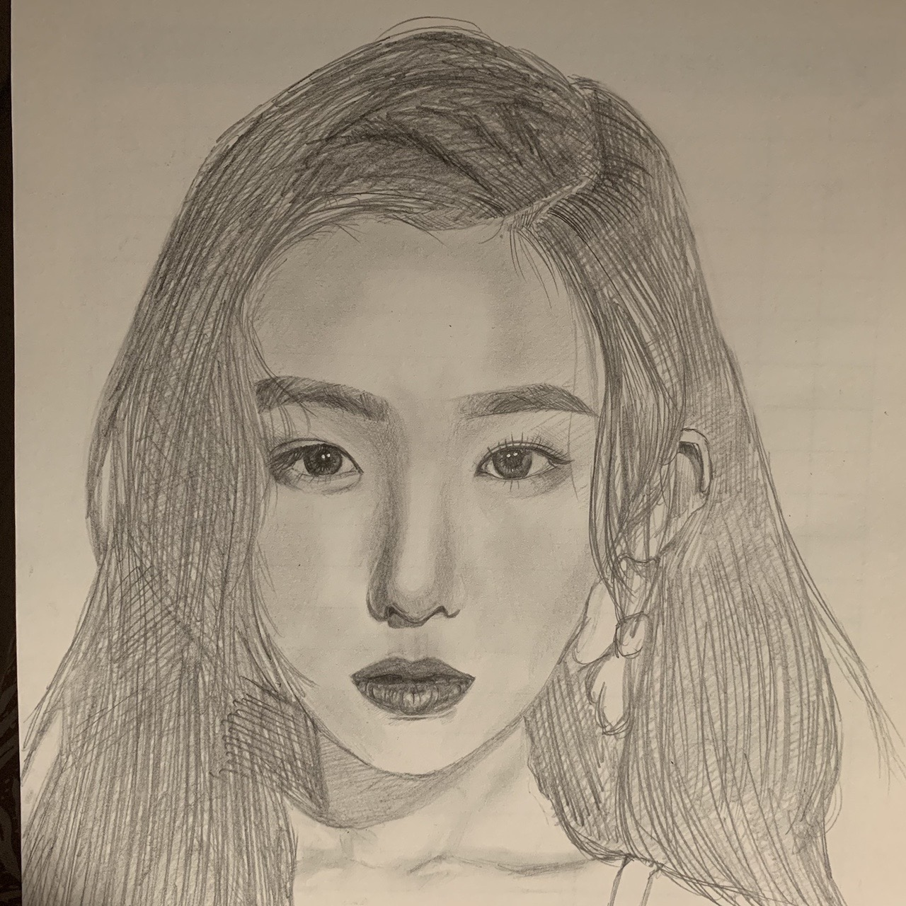
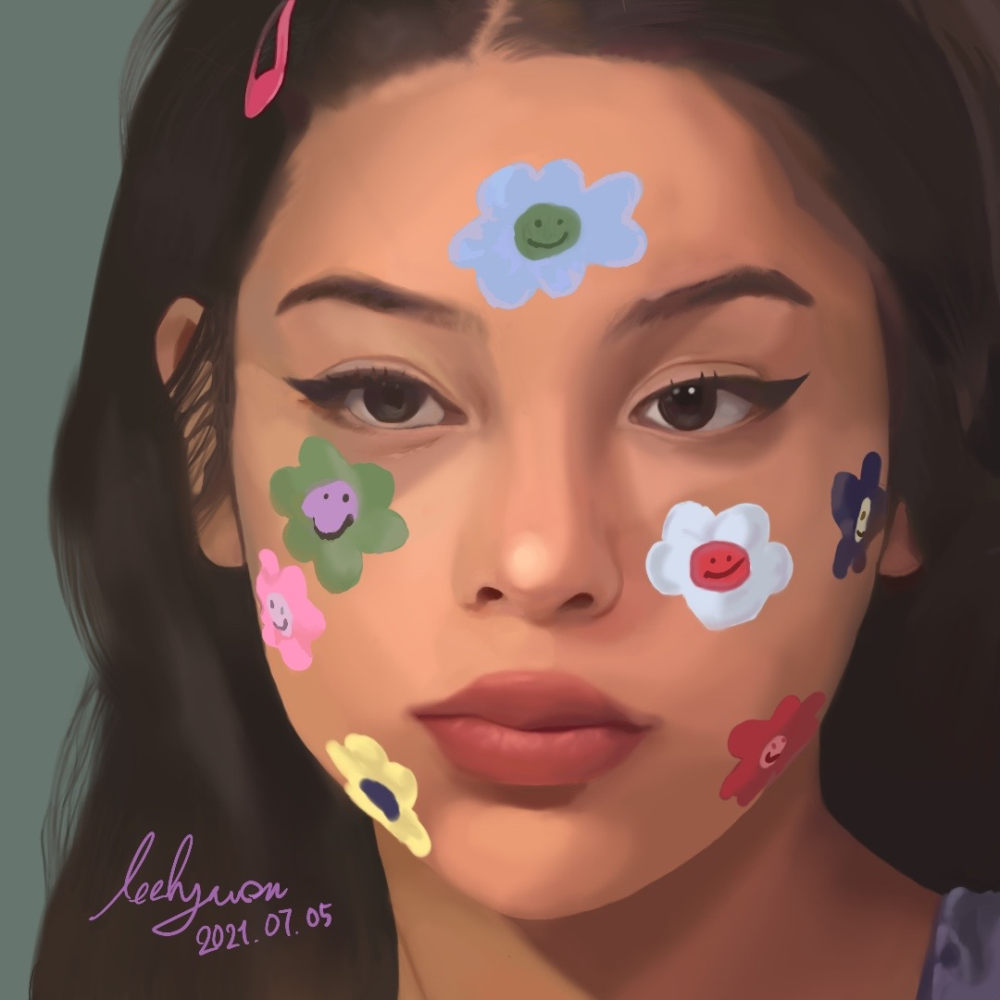
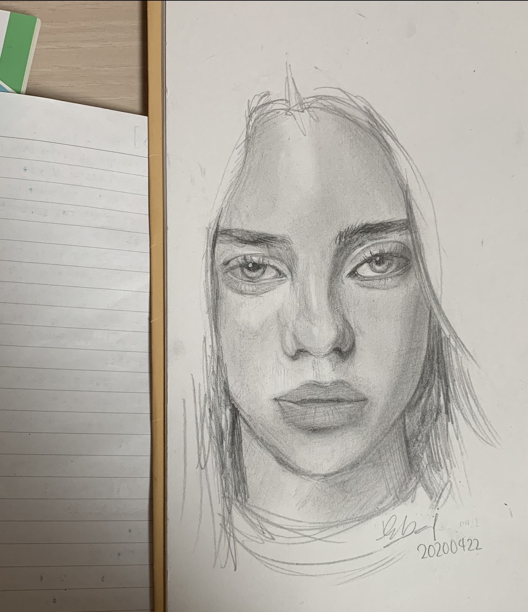

  My hobby is drawing.  
  Since childhood, I’ve loved copying comics and making sketches — I even attended an art academy because I was so passionate about it.  
  Although I’ve been too busy lately to draw much as an adult, it’s still something I truly enjoy. 🎨

---

## **Art Gallery**

  

    
  

  

    
  

  

    
  

  

    
  

  

    
  

  

    
  

---

_Image credit: [Unsplash](https://unsplash.com)_
