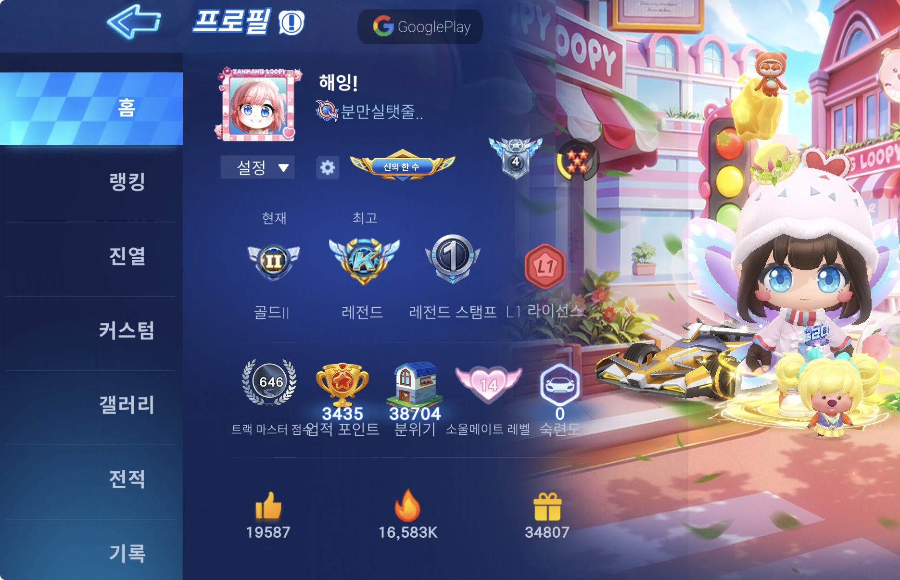

I love playing games.  
I mostly enjoy online games rather than PC single-player ones.  

Some of the games I play include **KartRider**, **Rummikub**, and **Minecraft**.  
If you’d like to play together, feel free to reach out! 😆

---

# **Game Screenshot Collection**

## 🧩 **Rummikub**

A brain-battle board game where you create combinations using numbers and colors.  
It’s a casual yet strategic game that requires focus and logical thinking.

  

    
  

---

## 🧱 **Minecraft**

A sandbox game where you can build and survive in a blocky world.  
You can play multiplayer through Xbox or local Wi-Fi, and it’s accessible to players of all ages.  
The only downside — it’s not free. 💸

  

    
  

---

## 🎯 **KartRider**

A racing game with various modes such as Speed and Item battles.  
It requires quick reflexes and decision-making, and it’s even more fun with friends.  
And yes — I’m **pretty good at it.** 🏎️

  

    
  

  

    
  

  

    
  

---

_Image credit: [Unsplash](https://unsplash.com)_

---

<!-- 🔍 Image Zoom Modal Effect -->

  &times;
  

