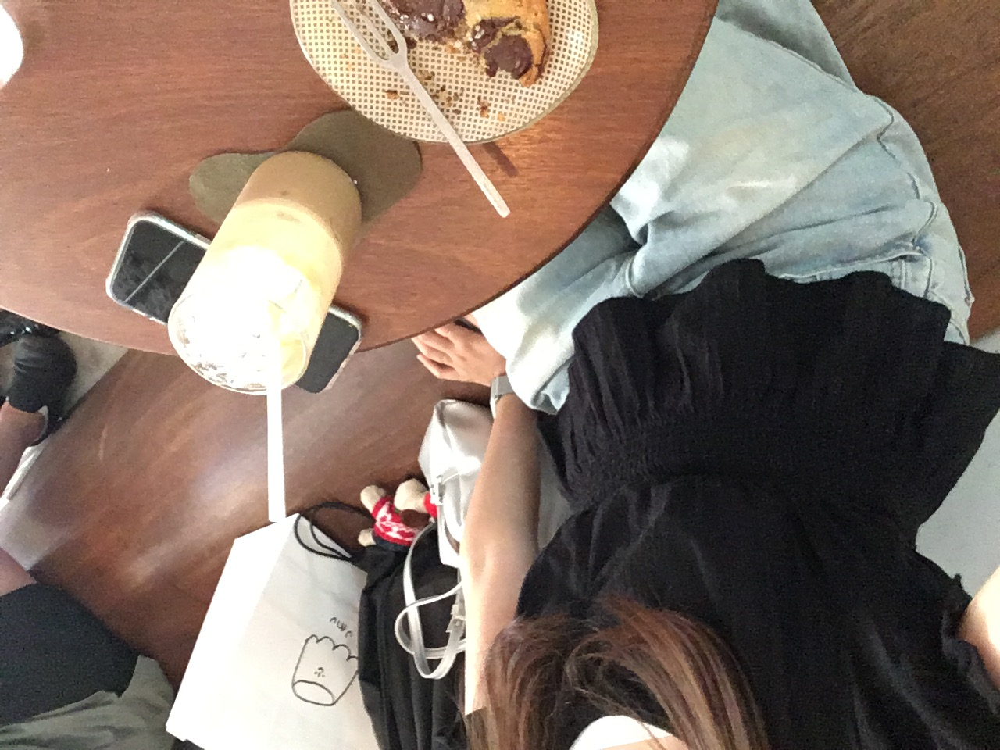
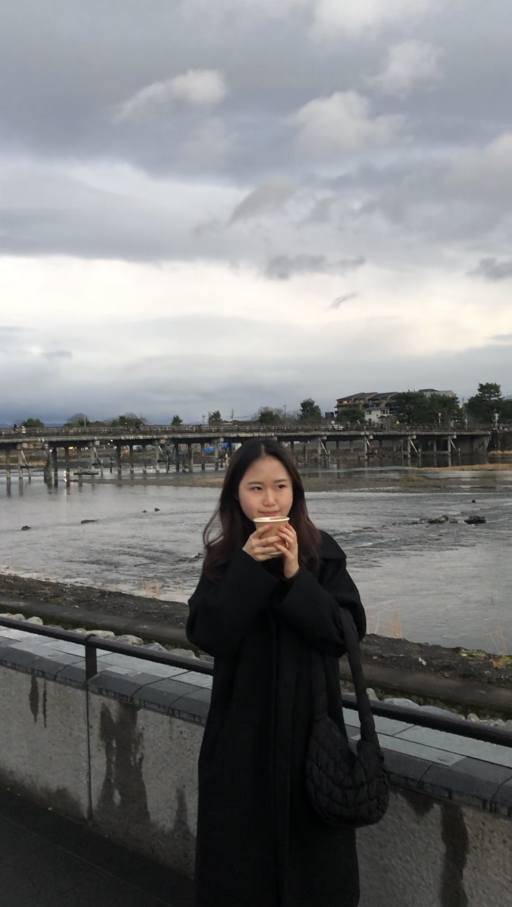

  I love traveling and taking photos along the way.  
  Exploring new places, experiencing different cultures, and enjoying the atmosphere always help me relieve stress.  
  If I had the money, I’d already be traveling around the world.  
  Whether domestic or abroad, traveling alone is one of my bucket list goals.

---

# 🏝️ **Domestic Travel**

## Jeju Island

I visited Jeju Island.  

I stayed there for three weeks through an exchange credit program with Jeju National University.  
The ocean in Jeju is absolutely beautiful — if I had a car, it would’ve been even more enjoyable.  
Although the heat was tough to endure, looking back, even that struggle became a fond memory.  
**I got an A+ for the course! Highly recommend it!**

  

    
  

  

    
  

  

    
  

  

    
  

    

    
  

  

    
  

---

# 🌏 **Overseas Travel**

## Japan

I traveled to Osaka and Kyoto.  

### Osaka
Osaka almost feels like a Korean city — it’s crowded, noisy, and honestly… (a bit messy 😅).  
But it’s a great place to see the **Glico Man** or visit **Universal Studios Japan**.

  

    
  

  

    
  

  

    
  

  

    
  

  

    
  

  

    
  

---

### Kyoto
Kyoto is a very peaceful, quiet, and clean city.  
Walking through its streets instantly lifts your mood — the atmosphere is wonderful.  
Next time I visit, I’ll definitely go to an onsen. ♨️  
**Highly recommend Kyoto!!**

  

    
  

  

    
  

  

    
  

  

    
  

  

    
  

  

    
  

---

## Thailand

### Phuket

I went to Phuket. 
I was almost in elementary school, so my memories are hazy, but I vividly remember snorkeling in the beautiful ocean. The local food didn't suit my taste, so it was a bit difficult. But looking back, even that feels like a fond memory.

  

    
  

  

    
  

---

_Image credit: [Unsplash](https://unsplash.com)_
