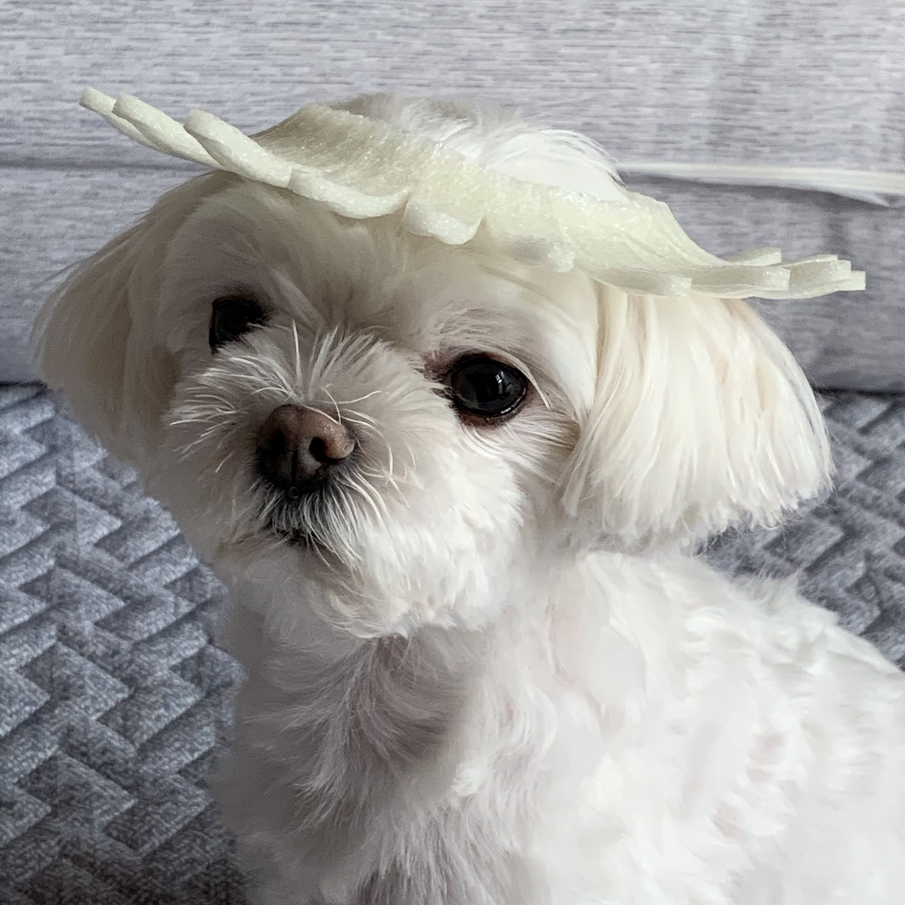
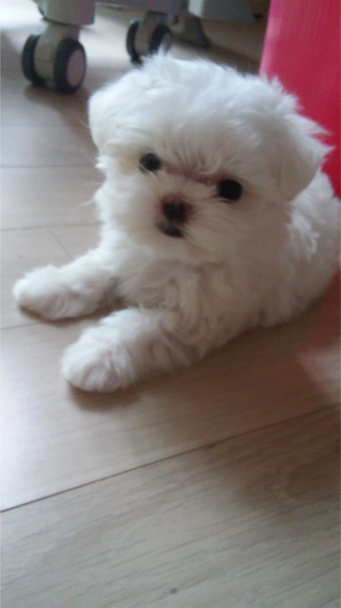
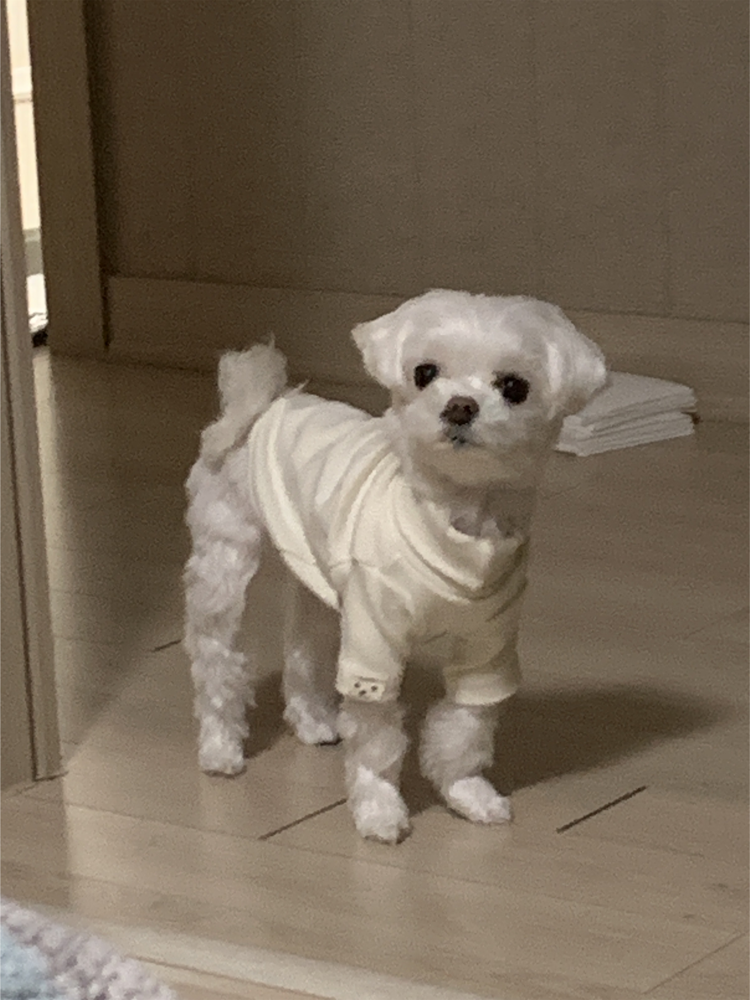
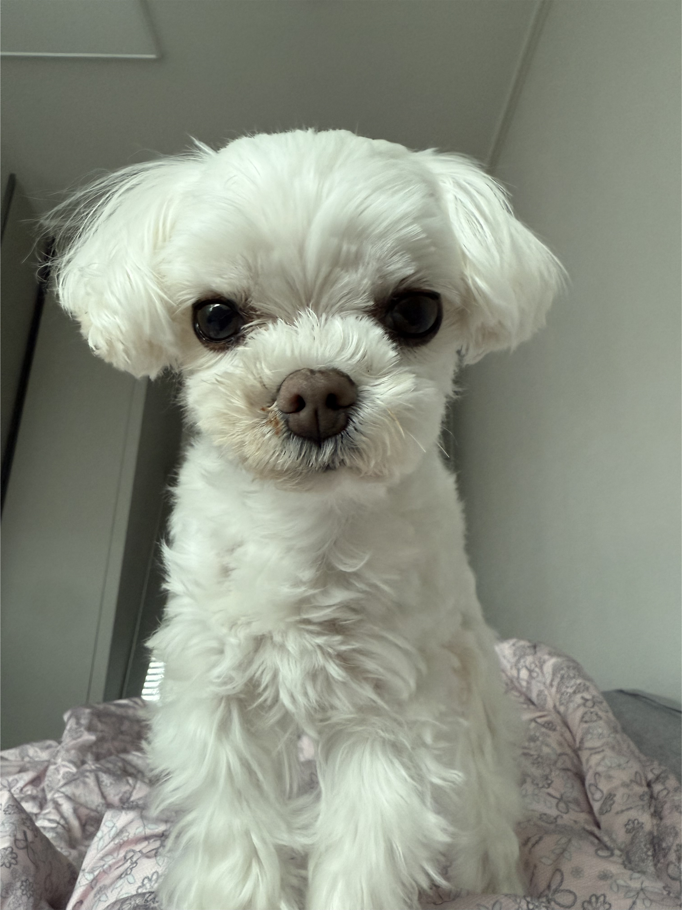
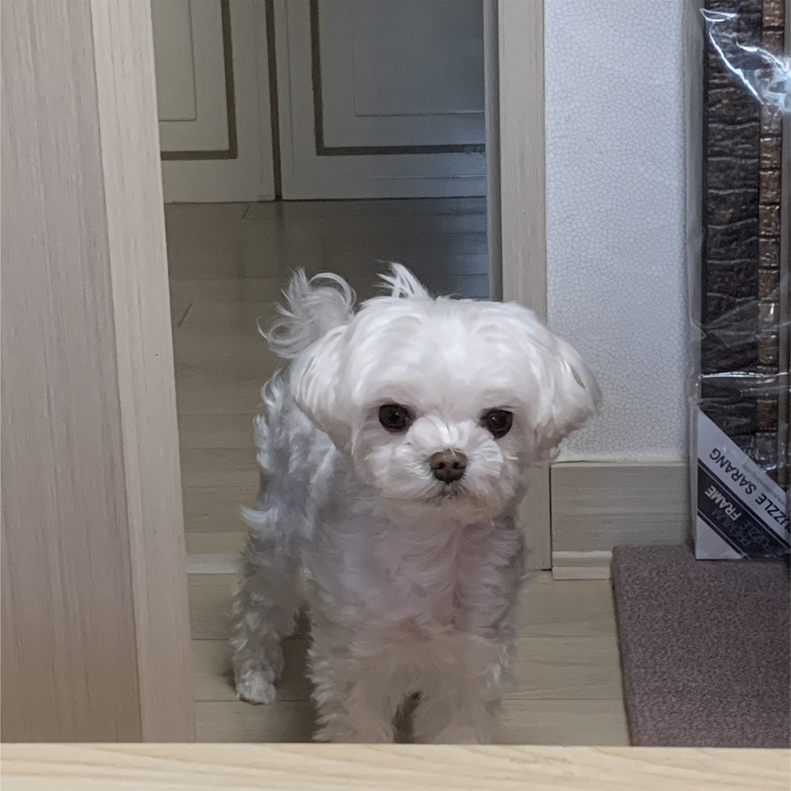
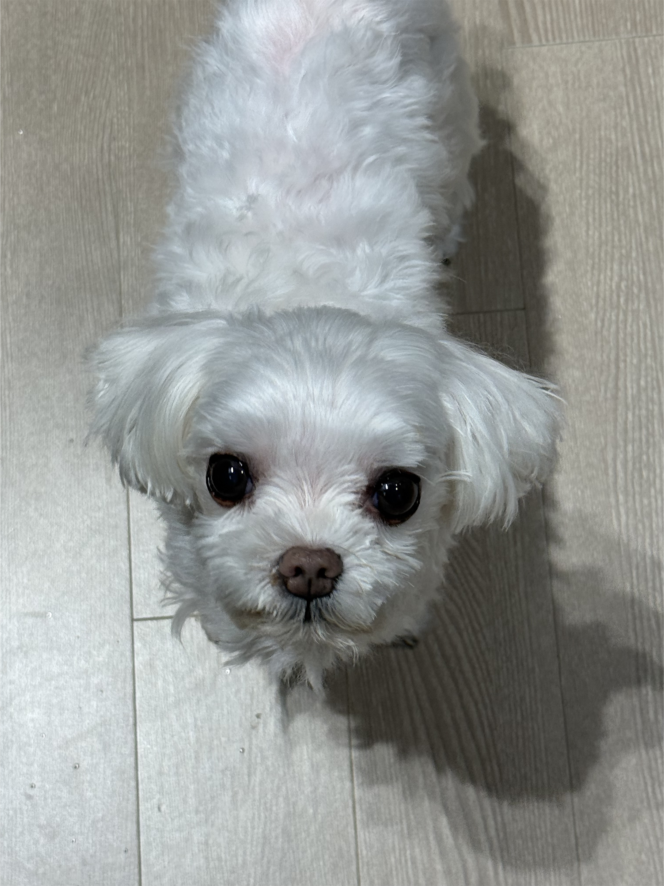

### 🐶 Profile  
Name: Ppeumi  
Born: 2016
gender: ♀
Weight: Under 2kg  
Breed: Maltese  
Likes: Sleeping  
Features: Sleeps about 20 hours a day, tiny and adorable, very cute

---

### 📸 Photo Gallery

  
  
  
  
  
  
  
  
  
  
  
  
  
  
  

<!-- Click image to enlarge (Modal) -->

  

