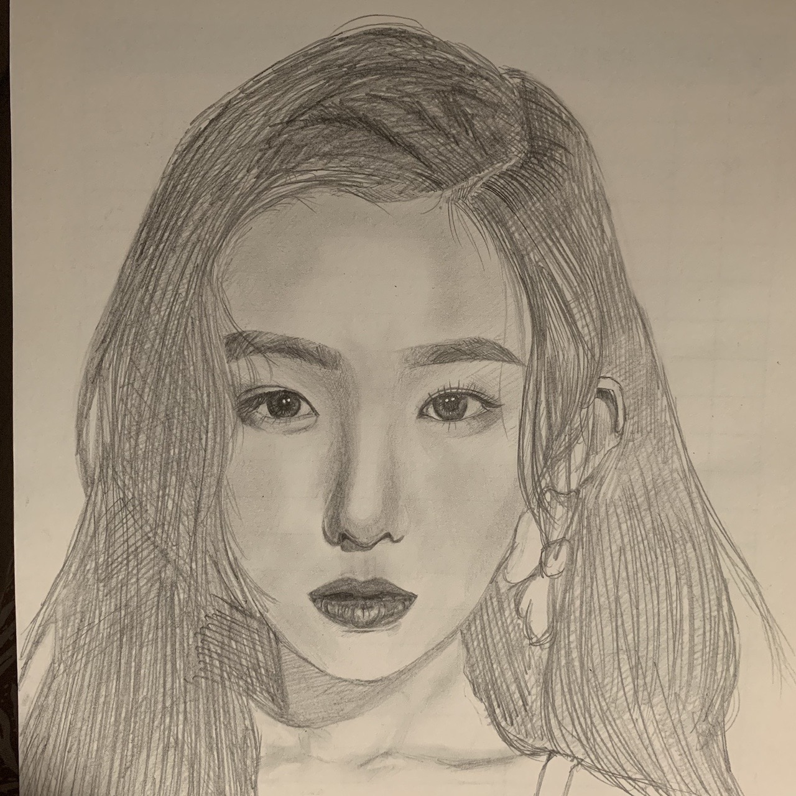
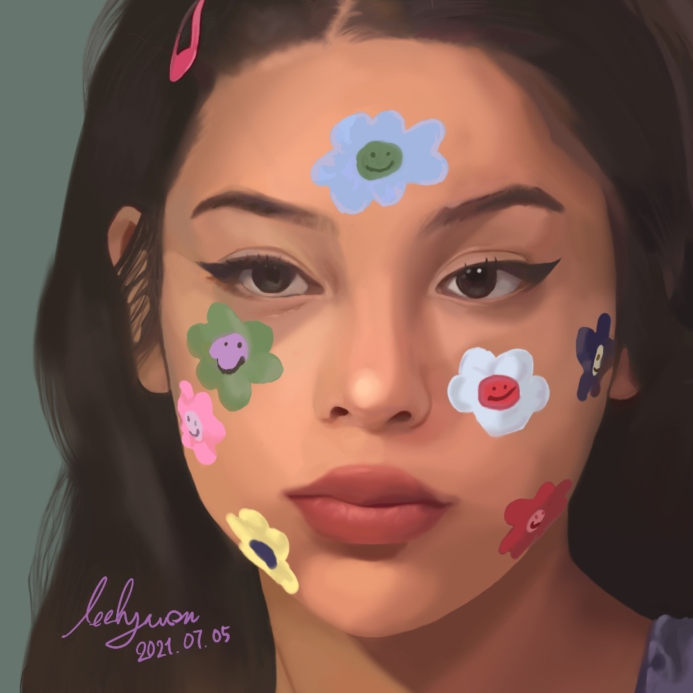
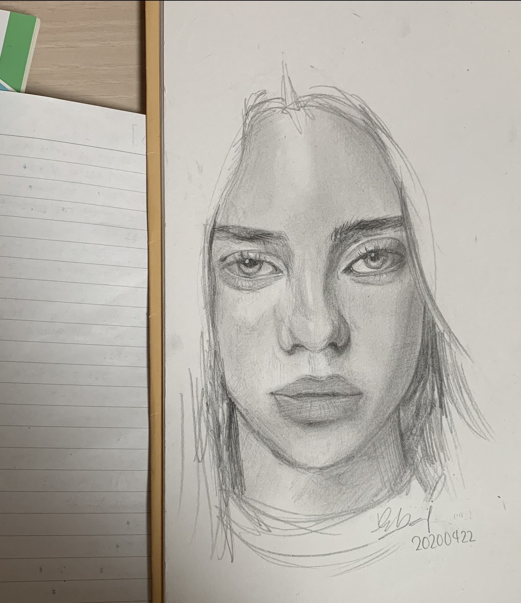

  저의 취미는 그림입니다.  
  어렸을 때부터 만화나 모작하길 좋아했고, 학원도 다닐 정도로 애정이 있었습니다.  
  현재는 현생이 바빠서 성인이 된 이후로는 거의 그리지 않지만, 여전히 좋아합니다. 🎨

---

## **그림 모음**

  

    
  

  

    
  

  

    
  

  

    
  

  

    
  

  

    
  

---

_Image credit: [Unsplash](https://unsplash.com)_

