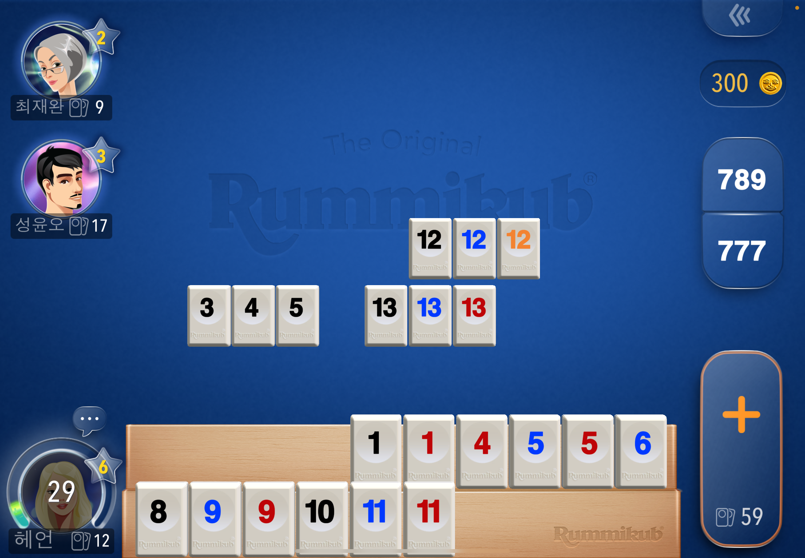
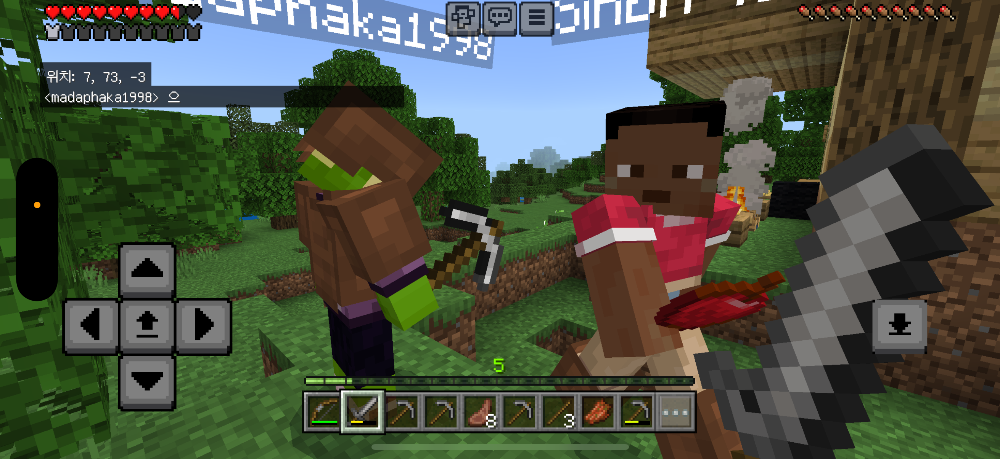
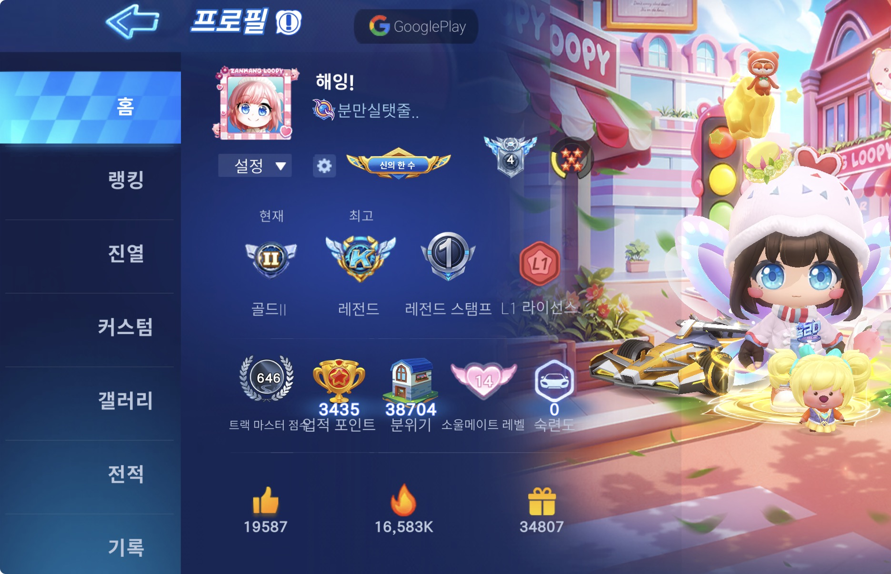

저는 게임을 좋아합니다.  
PC보다는 온라인 게임을 주로 합니다.  

제가 하는 게임은 **카트라이더**, **루미큐브**, **마인크래프트** 등이 있습니다.  
같이 하실 분 연락주세요! 😆

---

## **게임 스크린샷 모음**

---

## 🧩 **루미큐브 (Rummikub)**

두뇌 싸움 보드게임으로, 숫자와 색깔을 이용해 조합을 만들어가는 재미가 있습니다.  
가볍게 즐기면서도 집중력을 요하는 전략적인 게임입니다.

  

    
  

---

## 🧱 **마인크래프트 (Minecraft)**

네모난 세상에서 건축을 하거나 생존을 하는 게임입니다.  
Xbox나 같은 와이파이를 통해 멀티로도 즐길 수 있으며 누구나 쉽게 플레이할 수 있습니다.  
단점은 유료입니다. 💸

  

    
  

---

## 🎯 **카트라이더 (KartRider)**

스피드전, 아이템전 등 다양한 모드로 즐길 수 있는 레이싱 게임입니다.  
빠른 손놀림과 판단력이 요구되며 여러 사람들과 같이 플레이할 수 있습니다.  
저 **상당히 잘합니다.** 🏎️

  

    
  

  

    
  

  

    
  

---

_Image credit: [Unsplash](https://unsplash.com)_

---

<!-- 🔍 이미지 클릭 확대 (모달) 효과 추가 -->

<!-- 모달 구조 -->

  &times;
  

<!-- JS: 이미지 클릭 시 확대 -->

