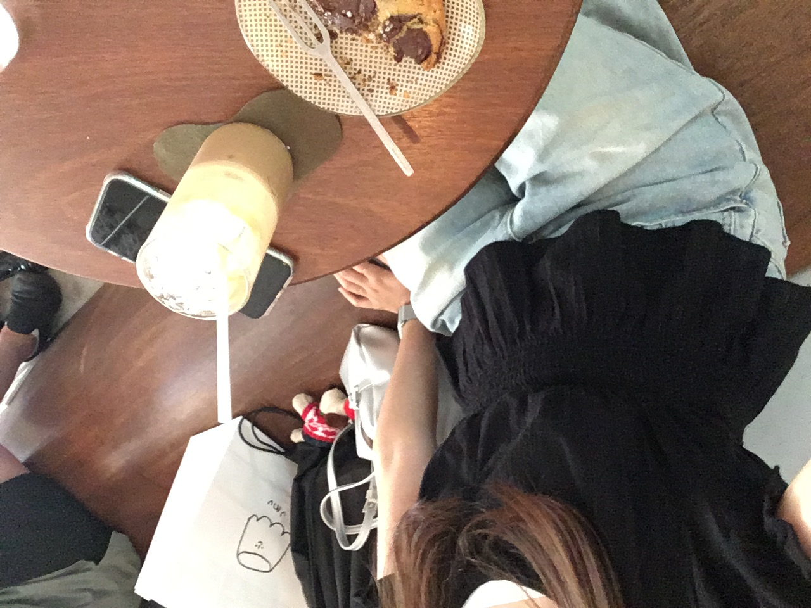
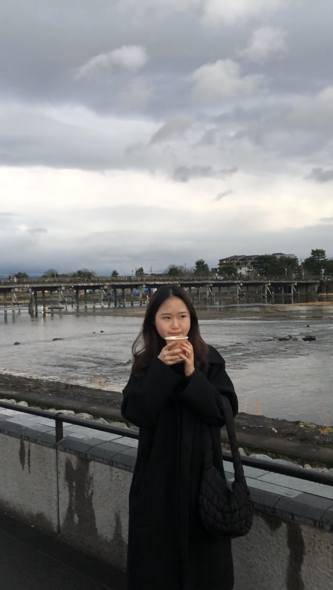

저는 여행을 하며 사진 남기는 것을 좋아합니다.  
여기저기 둘러보며 문화를 체험하고, 그 공간을 느끼고 즐기다보면 어느새 스트레스가 다 날아갑니다.
돈만 있었다면 세계 일주를 떠났을 겁니다.  
국내든 국외든 혼자 여행해보는 것이 제 버킷리스트 중 하나입니다.

---

# 🏝️ **국내 여행**

## 제주도

제주도에 다녀왔습니다.  

제주대 교류학점으로 3주간 살다 왔습니다.  
제주 바다는 정말 예쁩니다. 차가 있었다면 더 즐거운 생활이었을 것입니다.  
더위로 굉장히 고생했지만, 지금은 더위고 고생한 기억이 미화돼서 행복한 기억만 남았습니다.  
**학점은 A+ 받았습니다. 야호! 추천합니다.**

  

    
  

  

    
  

  

    
  

    

    
  

---

# 🌏 **해외 여행**

## 일본

오사카와 교토에 다녀왔습니다.  

### 오사카 (Osaka)
오사카는 거의 한국인 도시라고 해도 무방합니다.  
길거리도 북적북적하고 시끄럽고, 거리는 음… (더러워요) 
하지만 **글리코상**을 보거나 **유니버셜 스튜디오**에 가기에는 정말 좋습니다.

  

    
  

  

    
  

    

    
  

  

    
  

    

    
  

  

    
  

---

### 교토 (Kyoto)
교토는 아~~주 조용한 마을이고 한적하며 깨끗한 마을입니다.  
거리를 걸으면 기분이 좋아지고 분위기도 좋았습니다.  
다음에 다시 방문하면 그땐 꼭 온천을 갈 것입니다. ♨️
**교토 강추!!**

  

    
  

  

    
  

  

    
  

  

    
  

    

    
  

  

    
  

---

## 태국

### 🌊 푸켓 (Phuket)

푸켓에 다녀왔습니다.  
거의 초등학생 때라 기억이 잘 나지 않지만, 스노클링이 정말 즐거웠습니다. 밥은 제 입맛에 안 맞아서 조금 힘들었지만,  
지금 생각해보면 그조차 추억인거 같습니다.

  

    
  

  

    
  

---
  

_Image credit: [Unsplash](https://unsplash.com)_
